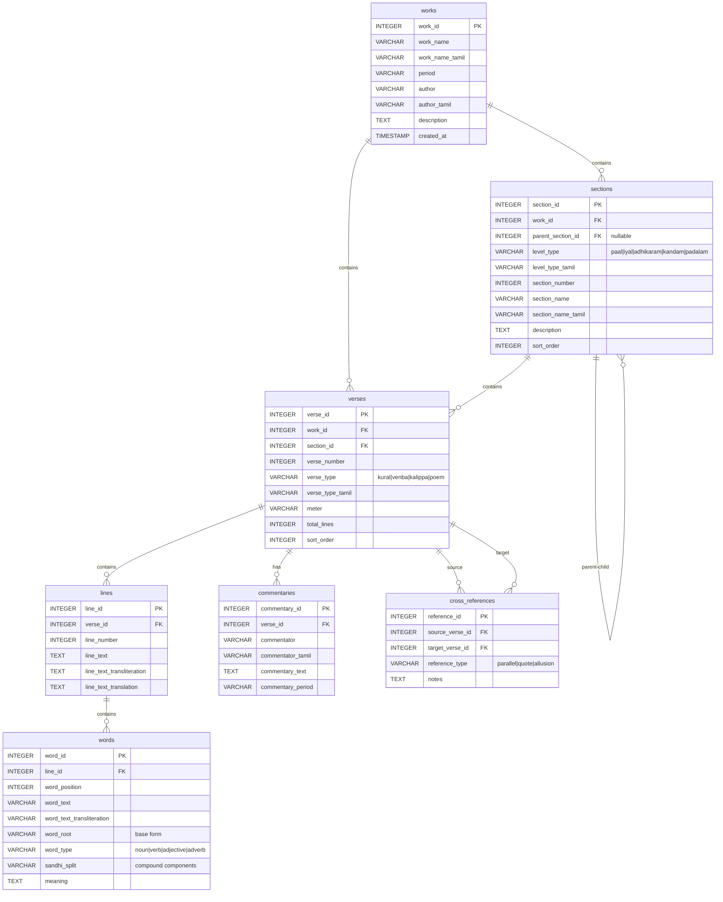

# Tamil Literary Works Database - ER Diagram

## Entity Relationship Diagram



## Views

### verse_hierarchy (Materialized View)
- Computes complete hierarchical path for each verse
- Uses recursive CTE to traverse section tree
- Output: `verse_id`, `verse_number`, `verse_type`, `work_name`, `hierarchy_path`, `hierarchy_depth`

### word_details (Materialized View)
- Joins words with complete context (line, verse, work, hierarchy)
- Provides ready-to-use data for word searches
- Output: All word fields + line text + verse info + hierarchy path

## Relationship Details

### 1. works → sections (One-to-Many)
- Each work has multiple hierarchical sections
- Relationship: `works.work_id = sections.work_id`

### 2. sections → sections (Self-Referencing, One-to-Many)
- Supports unlimited hierarchical depth
- `parent_section_id` references `section_id`
- NULL `parent_section_id` indicates top-level section
- Example: Paal → Iyal → Adhikaram (3 levels deep)

### 3. works → verses (One-to-Many)
- Each work contains multiple verses
- Relationship: `works.work_id = verses.work_id`

### 4. sections → verses (One-to-Many)
- Verses belong to the most specific section
- Example: Kural belongs to specific Adhikaram
- Relationship: `sections.section_id = verses.section_id`

### 5. verses → lines (One-to-Many)
- Each verse has one or more lines
- Lines are ordered by `line_number`
- Relationship: `verses.verse_id = lines.verse_id`

### 6. lines → words (One-to-Many)
- Each line is broken down into individual words
- Words maintain position with `word_position`
- Relationship: `lines.line_id = words.line_id`

### 7. verses → commentaries (One-to-Many)
- Multiple commentators can comment on same verse
- Stores traditional and modern interpretations
- Relationship: `verses.verse_id = commentaries.verse_id`

### 8. verses → cross_references (Many-to-Many, Self-Referencing)
- Links related verses within or across works
- `source_verse_id`: verse making the reference
- `target_verse_id`: verse being referenced
- Types: parallel themes, direct quotes, allusions

## Data Flow Example: Thirukkural Kural 1

```
Work: Thirukkural (work_id=3)
  │
  └─→ Section: Aram Paal (section_id=1, parent=NULL, level=paal)
       │
       └─→ Section: Pāyiram Iyal (section_id=4, parent=1, level=iyal)
            │
            └─→ Section: Kadavul Vazhthu (section_id=6, parent=4, level=adhikaram)
                 │
                 └─→ Verse: Kural 1 (verse_id=1, section_id=6)
                      │
                      ├─→ Line 1 (line_id=1): "அகர முதல எழுத்தெல்லாம் ஆதி"
                      │    │
                      │    ├─→ Word 1: "அகர" (word_id=1, position=1, root="அ", type=noun)
                      │    ├─→ Word 2: "முதல" (word_id=2, position=2, root="முதல்", type=adjective)
                      │    ├─→ Word 3: "எழுத்தெல்லாம்" (word_id=3, position=3, sandhi_split="எழுத்து + எல்லாம்")
                      │    └─→ Word 4: "ஆதி" (word_id=4, position=4)
                      │
                      └─→ Line 2 (line_id=2): "பகவன் முதற்றே உலகு"
                           │
                           ├─→ Word 1: "பகவன்" (word_id=5, position=1)
                           ├─→ Word 2: "முதற்றே" (word_id=6, position=2, root="முதல்")
                           └─→ Word 3: "உலகு" (word_id=7, position=3)
```

## Key Features of This Schema

### 1. Flexible Hierarchy
- Self-referencing `sections` table supports any depth
- Different works use different level types (paal, kandam, etc.)
- No hardcoded levels in schema

### 2. Word-Level Granularity
- Every word stored individually with position
- Root form enables morphological analysis
- Sandhi split preserves compound word structure

### 3. Ordering Preserved
- `sort_order` in sections and verses
- `line_number` and `word_position` maintain sequence
- Enables proper reconstruction of original text

### 4. Efficient Querying
- Indexes on foreign keys and frequently searched columns
- Views pre-compute complex joins
- Recursive CTE for hierarchical queries

### 5. Metadata Support
- Commentaries from multiple scholars
- Cross-references for textual analysis
- Translation and transliteration fields

## Cardinality Summary

| Relationship | Type | Notes |
|--------------|------|-------|
| work → sections | 1:N | Each work has many sections |
| section → child sections | 1:N | Recursive, unlimited depth |
| work → verses | 1:N | Each work has many verses |
| section → verses | 1:N | Verses in most specific section |
| verse → lines | 1:N | Typically 2-4 lines per verse |
| line → words | 1:N | 3-15 words per line average |
| verse → commentaries | 1:N | Multiple commentaries possible |
| verse ↔ verse | N:N | Cross-references (self-referencing) |

## Indexes for Performance

```sql
-- Hierarchical traversal
CREATE INDEX idx_sections_parent ON sections(parent_section_id);
CREATE INDEX idx_sections_work ON sections(work_id);

-- Verse lookups
CREATE INDEX idx_verses_section ON verses(section_id);
CREATE INDEX idx_verses_work ON verses(work_id);

-- Line and word navigation
CREATE INDEX idx_lines_verse ON lines(verse_id);
CREATE INDEX idx_words_line ON words(line_id);

-- Word search optimization
CREATE INDEX idx_words_text ON words(word_text);
CREATE INDEX idx_words_root ON words(word_root);
```

## Design Principles

1. **Normalization**: Minimized redundancy, data stored at appropriate levels
2. **Flexibility**: Schema supports diverse literary structures
3. **Performance**: Strategic indexes and views for common queries
4. **Extensibility**: Easy to add new works without schema changes
5. **Unicode Support**: Full Tamil character support throughout
6. **Referential Integrity**: Foreign keys enforce data consistency
